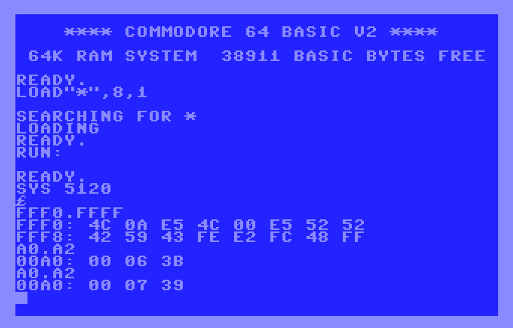
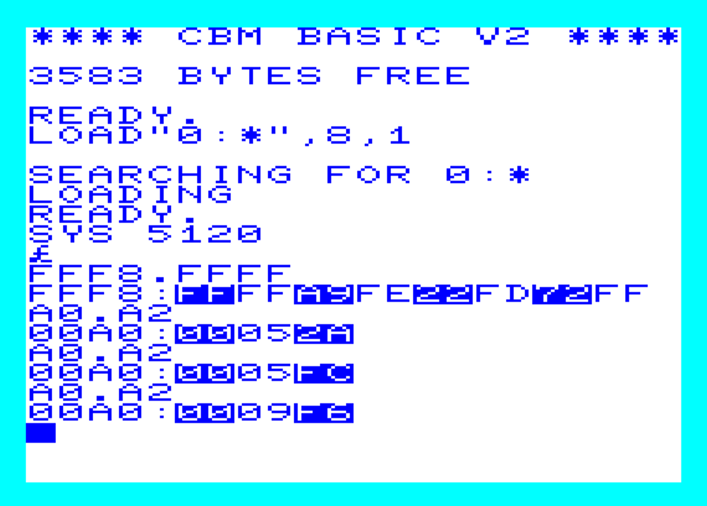
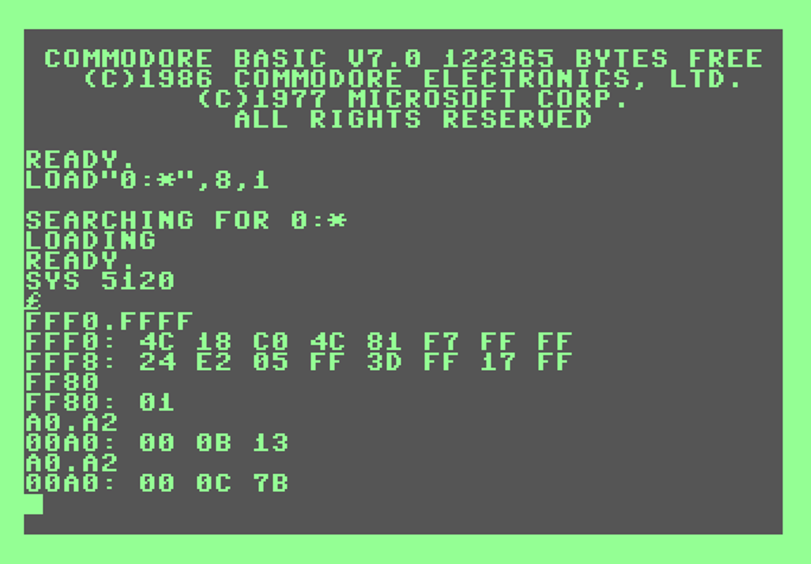
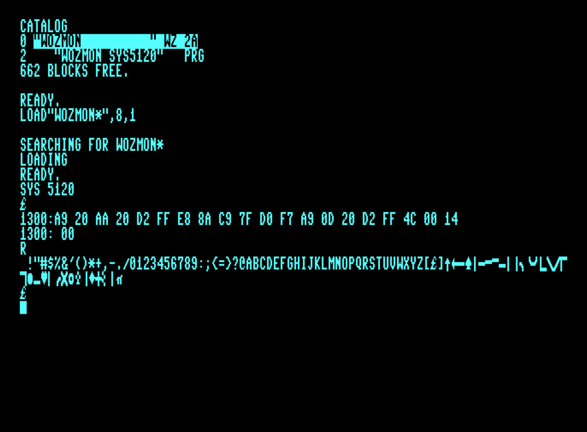

# wozmon 6502 hex monitor for Commodore 8-bit #

WozMon is the default monitor for Apple 1 ROMs as documented in the Apple-1 Operation Manual by Apple Computer Company

Written by Steve Wozniak for the Apple 1 release

Here is a (yet another) port to Commodore.  This version intends to support at least three of the common models

* Commodore 64
* Vic-20
* Commodore 128

(I've loaded and run it on TED Plus/4 system, but the zero page usage overlaps the clock, so something needs to change, same for PET 2001)

Why would you use this?  Mostly for historic, nostalgic reasons.  Also it fits in 256 bytes.

This project is built to compile the source with ACME and VICE tools.  Should be easy enough to adapt to other assemblers.  Its load address is $1400 (5120) so it can work with most of these systems unchanged.   Note the routines have different addresses than on the Apple-1 so when entering hex programs for it, be sure to adapt for the addresses.  See [wozmon.lst](wozmon.lst).   Originally I [ported it to minimum 6502/6850 system](https://x.com/DaveRVW/status/1788049720470020570).

Because it uses the Commodore KERNAL screen editor, you can cursor around the screen, edit, and press ENTER again on existing lines.

Usage:

``LOAD "WOZMON*",8,1``

``LOAD "VWAS6502",8,1`` (optional to load the new disassembler)

``SYS 5120``

wozmon shows a backslash prompt on the Apple 1.  On Commodore it is £.

Example statements:

* ``01FF`` to display single memory byte
* ``FF00.FF7F`` to display memory range
* ``1000: 01 02 03 04`` to enter bytes into memory
* ``1000 R`` to JMP to machine code at address
* ``1500 R 1400`` to start disassembly of wozmon (1400 is address to list 20 statements) *** requires vwasm6502 loaded at $1500 ***

